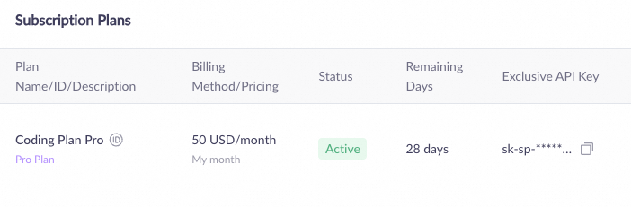
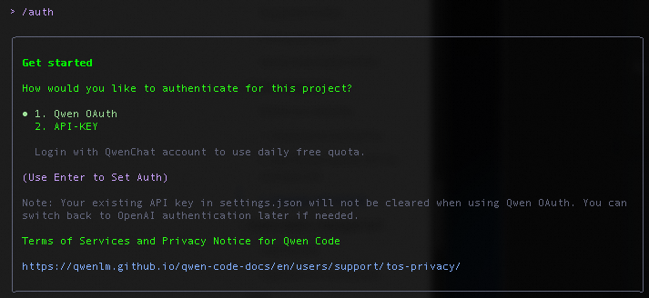
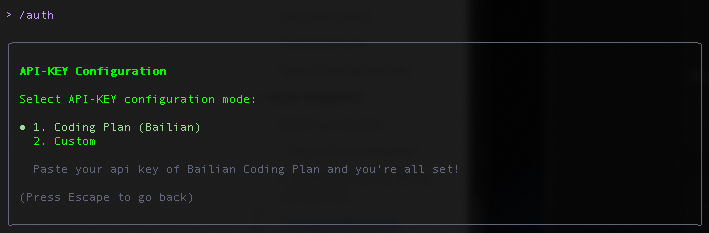
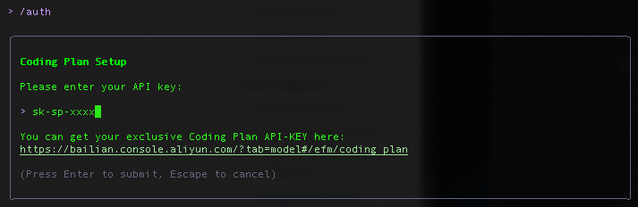
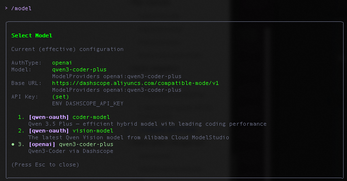

# Qwen Code

Qwen Code is an advanced AI-powered coding assistant that helps developers write, debug, and optimize code using the power of Alibaba Cloud's Qwen language models.

## Prerequisites

Before installing Qwen Code, ensure you have:

- A computer running macOS, Linux, or Windows
- Node.js 20 or later (required for manual installation)
- Basic knowledge of command-line interface
- Alibaba Cloud account
- Subscribed to the Coding Plan (Recommended) or Alibaba Cloud Model Studio


## Step-by-Step Installation Guide

## Before You Subscribe

Before subscribing to the Coding Plan, please note:
- Only Alibaba Cloud accounts can subscribe to and use this plan. RAM users are not supported.
- No API calls are allowed: The quota can only be used in coding tools. Do not use it for API calls in automated scripts, custom application backends, or any non-interactive batch calling scenarios.

## 1. Subscribe to Coding Plan
For the most up-to-date information, please refer to the original documentation: [Alibaba Cloud Model Studio Coding Plan](https://www.alibabacloud.com/help/en/model-studio/coding-plan?spm=a2c63.p38356.help-menu-2400256.d_0_1_4.36b176c7EN3zY3)

1. Go to the Alibaba Cloud Model Studio Coding Plan subscription page, and select and purchase a plan that meets your needs.
   - Only Alibaba Cloud accounts can subscribe to and use this plan. RAM users cannot subscribe.
2. After your purchase, go to the Model Studio homepage. Click Settings in the upper-right corner, and select Subscription Plan in the navigation pane on the left to access the console. Here you can view usage, upgrade, or renew your plan.

## 2. Get the Plan-Specific API Key and Base URL

1. **API key**: Go to the Coding Plan console to get your plan-exclusive API key in the format `sk-sp-xxxxx`. Do not confuse this with the general-purpose Model Studio API key (format: `sk-xxxxx`).



2. **Base URL**: Use the corresponding fixed base URL based on the API protocol supported by your AI tool. Do not confuse it with the general-purpose Model Studio base URL (dashscope.aliyuncs.xxx).
   - OpenAI-compatible: `https://coding-intl.dashscope.aliyuncs.com/v1`
   - Anthropic-compatible: `https://coding-intl.dashscope.aliyuncs.com/apps/anthropic`


## 3. Install Qwen Code CLI

**Linux/MacOS:**
```bash
curl -fsSL https://qwen-code-assets.oss-cn-hangzhou.aliyuncs.com/installation/install-qwen.sh | bash
```

**Windows (Run as Administrator CMD):**
```cmd
curl -fsSL -o %TEMP%\install-qwen.bat https://qwen-code-assets.oss-cn-hangzhou.aliyuncs.com/installation/install-qwen.bat && %TEMP%\install-qwen.bat
```

### Manual Installation

**NPM:**
```bash
npm install -g @qwen-code/qwen-code@latest
```

**Homebrew (MacOS, Linux):**
```bash
brew install qwen-code
```

> Note: After installation, restart your terminal to ensure environment variables take effect.


**Verfication:**
   ```bash
   qwen --version
   ```
   Ensure you have version ≥ 0.10.1

## 4. Configure Qwen Code CLI

1. Open a terminal and navigate to your project directory. Run qwen to start Qwen Code:
   ```bash
   cd path/to/your_project
   qwen
   ```

2. After starting Qwen Code, enter `/auth` and select **API-KEY**.



3. Then select Coding Plan.



4. Enter your Coding Plan key, for example: `sk-sp-xxxxxxxxx`.
   - Your API key is saved. It loads automatically in new sessions, so you do not need to reconfigure it.



5. Use Qwen Code.

## 4. Switch Models in Qwen Code

Enter `/model` to switch between models supported by Alibaba Cloud Model Studio Coding Plan. For example, select `qwen3-coder-plus`.

The main supported models are:
- `qwen3-coder-plus` (Recommended: latest code generation model)
- `qwen3-max-2026-01-23` (latest flagship reasoning model)



## Advanced Configurations

### Checking Qwen Code Configuration Settings
The recommended way to configure models and providers is by editing `~/.qwen/settings.json`.

#### Basic Configuration Example:
```json
{
  "modelProviders": {
    "openai": [
      {
        "id": "qwen3-coder-plus",
        "name": "qwen3-coder-plus",
        "baseUrl": "https://coding.dashscope.aliyuncs.com/v1",
        "description": "qwen3-coder-plus model from Bailian Coding Plan",
        "envKey": "BAILIAN_CODING_PLAN_API_KEY"
      }
    ]
  },
  "env": {
    "BAILIAN_CODING_PLAN_API_KEY": "sk-sp-xxxxxxxxxxxxx"
  },
  "security": {
    "auth": {
      "selectedType": "openai"
    }
  },
  "model": {
    "name": "qwen3-coder-plus"
  }
}
```

#### Field Descriptions:
- `modelProviders`: Declares which models are available and how to connect to them
- `modelProviders[].id`: The model ID sent to the API
- `modelProviders[].envKey`: Name of the environment variable that holds your API key
- `modelProviders[].baseUrl`: API endpoint URL (required for non-default endpoints)
- `env`: Fallback place to store API keys (lower priority)
- `security.auth.selectedType`: Protocol to use on startup (openai, anthropic, gemini, vertex-ai)
- `model.name`: Default model to use when Qwen Code starts

### Multiple Provider Example:
```json
{
  "modelProviders": {
    "openai": [
      {
        "id": "gpt-4o",
        "name": "GPT-4o",
        "envKey": "OPENAI_API_KEY",
        "baseUrl": "https://api.openai.com/v1"
      }
    ],
    "anthropic": [
      {
        "id": "claude-sonnet-4-20250514",
        "name": "Claude Sonnet 4",
        "envKey": "ANTHROPIC_API_KEY"
      }
    ],
    "gemini": [
      {
        "id": "gemini-2.5-pro",
        "name": "Gemini 2.5 Pro",
        "envKey": "GEMINI_API_KEY"
      }
    ]
  },
  "env": {
    "OPENAI_API_KEY": "sk-xxxxxxxxxxxxx",
    "ANTHROPIC_API_KEY": "sk-ant-xxxxxxxxxxxxx",
    "GEMINI_API_KEY": "AIzaxxxxxxxxxxxxx"
  },
  "security": {
    "auth": {
      "selectedType": "openai"
    }
  },
  "model": {
    "name": "gpt-4o"
  }
}
```

> Security note: Never commit API keys to version control. The `~/.qwen/settings.json` file is in your home directory and should stay private.

## Quick Start

After installation:
```bash
# Start Qwen Code (interactive)
qwen

# Then, in the session:
/help
/auth
```

On first use, you'll be prompted to sign in. You can run `/auth` anytime to switch authentication methods.

## Supported Providers

- OpenAI-compatible: Alibaba Cloud Bailian, ModelScope, OpenAI, OpenRouter, and other OpenAI-compatible providers
- Anthropic: Claude models
- Google GenAI: Gemini models

API keys can also be set via `export` in your shell or `.env` files, which take higher priority than `settings.json` → `env`.

## API Key Security Best Practices

- Never hardcode your API key in source code
- Use environment variables or secure credential storage
- Rotate your API key periodically
- Monitor API usage in the Alibaba Cloud Console
- Restrict API key permissions to only necessary services
- Do not share your API key with others
- Never commit API keys to version control

## Troubleshooting

### Common Issues

1. **Authentication Error**: Verify your API key is correctly set in environment variables or settings.json
2. **Rate Limiting**: Check your account limits and adjust usage accordingly
3. **Connection Issues**: Ensure your network allows connections to the API endpoints
4. **OAuth Issues**: If using OAuth in headless environments, switch to API-KEY method

### Getting Help

For additional support:
- Check the [official documentation](https://github.com/QwenLM/qwen-code)
- Visit our [GitHub repository](https://github.com/QwenLM/qwen-code)
- Join our community forums

## Contributing

We welcome contributions to improve Qwen Code. Please see our [contributing guide](CONTRIBUTING.md) for more details.

## License

This project is licensed under the Apache 2.0 License - see the LICENSE file for details.